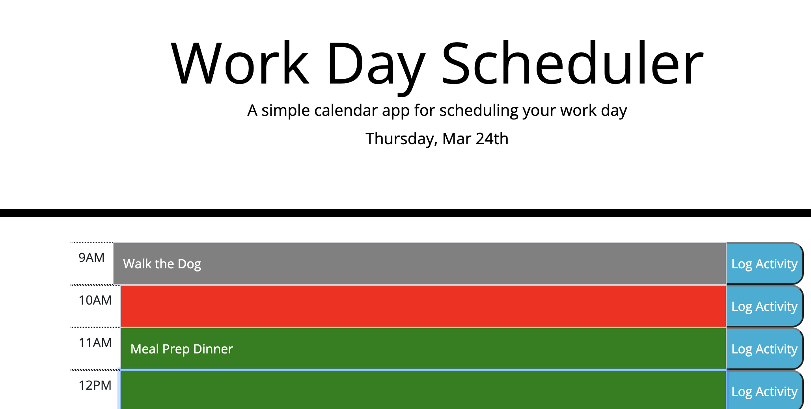

# calendarAssistant

## Description

Rough day in the office, hate keeping track of your daily activities? Well look no further! This application uses local storage to keep track of your daily tasks and highlights what hour of the day we are on to make sure you aren't falling behind!

## Table of Contents

Below are the contents of this project's Readme.

- [Installation](#installation)
- [Usage](#usage)
- [Credits](#credits)

## Installation

Based on some code that was used as a groundwork I built a calendar using jQuery, Bootstrap and Javascript. This was installed on github, please see links in usage to access.

## Usage

This calendar is used to track the tasks one has to complete during the work day, as shown in the image below.

Please see the links below to access:

https://github.com/kgiunta/calendarAssistant

## Credits

The following people helped bring this application alive:

Jehyun Jung | Penn LPS Tutor  
Dominick Albano |https://github.com/dev-dominick
Issak Morales |https://github.com/CallMeIce
